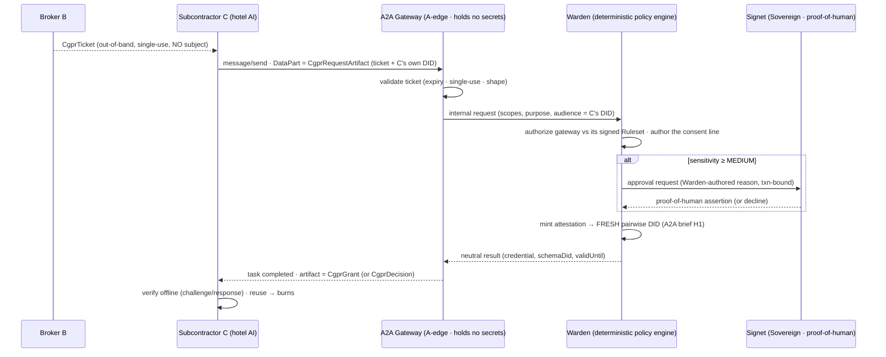

# Hearthold — A2A Gateway for Consent-Gated Preference Requests (CGPR)

**Status:** running code, e2e-tested. **A2A:** 1.0.0. **Extension:** `https://hearthold.dev/2026/a2a/cgpr/v1`
**For:** the DIF Hospitality & Travel WG's Consent-Gated Preference Request flow (Alex Bainbridge / Autoura).
**Run it:** `npm run demo:cgpr` (a narrated, ~1-minute walk that prints the `curl` for every step).

CGPR is the pattern where a consumer **A** deals with a broker **B**, who subcontracts a task to **C**
(a hotel/restaurant AI agent). C needs some of A's preferences; **B must never see them**, and **C must
never receive a reusable identifier for A before A approves.** Hearthold is the sovereign-side reference
implementation: the gateway is an **A2A boundary adapter** (A2A at the edge, DIDComm + the Hearthold wire
protocol internally), and behind it the Warden turns a request into a scoped, expiring, single-use
attestation minted to a **fresh pairwise DID**.

## The flow



The task reaches **`input-required`** while consent is pending (the async Signet path); on a LOW scope it
clears at STANDING and completes synchronously. C polls with **`tasks/get`**.

## The four wire objects

Registered as Archon schema DIDs (`registerCgprSchemas`) so the same shapes verify on both sides. Full
JSON Schemas: `@hearthold/cgpr-types`.

**CgprTicket** — B → C. Note there is **no subject field**, and `additionalProperties:false` makes one
structurally impossible (conformance rule #1), not merely optional.
```json
{
  "ticketId": "b4f1…-uuid",
  "expiresAt": "2026-07-11T18:05:00Z",
  "singleUse": true,
  "scopes": ["foodAndBeverage.dietaryRestrictions"],
  "purpose": "Plan the guest menu",
  "privacyControls": { "retention": "72h", "sharing": "none" }
}
```

**CgprRequestArtifact** — C → gateway, inside a `message/send` DataPart. C identifies **itself** (for
audience-binding); A is never named.
```json
{
  "message": { "role": "user", "messageId": "…", "parts": [
    { "kind": "data", "data": {
      "ticket": { "…": "the CgprTicket above" },
      "requester": { "did": "did:cid:hotelAgent…", "agentCardUrl": "https://hotel.example/agent-card.json" },
      "validForMinutes": 4320
    } }
  ] }
}
```

**CgprGrant** — the approve path, returned as the completed task's artifact. The credential's subject is a
fresh pairwise DID; single-use.
```json
{ "ticketId": "b4f1…", "credential": { "…": "the attestation VC (credentialSubject.id = pairwise DID)" },
  "schemaDid": "did:cid:schema…", "validUntil": "2026-07-14T18:07:34Z", "singleUse": true }
```

**CgprDecision** — the deny path. Exactly the ticketId and the decision — **no reason string** (a reason
can leak).
```json
{ "ticketId": "b4f1…", "decision": "denied" }
```

## Why the Warden authors the consent text (the deliberate improvement)

The raw CGPR sketch lets the requester describe its own request on the approval screen. When C is an AI
agent, that is a manipulation channel. Hearthold closes it **structurally**: C's `CgprRequestArtifact` is
*input evidence*, never the consent surface. What the Sovereign sees at the Signet is a **Warden-authored**
line — e.g. *"Disclose foodAndBeverage.dietaryRestrictions to did:cid:hotelAgent… for: Plan the guest menu
— backed by 1 witnessed document observation(s)"* — so a world-facing agent can't misdescribe what it's
getting the human to approve. This is enforced by construction: the mint path never surfaces the
requester's words as the reason.

## Trust posture

- **A2A at the edge only.** No A2A type reaches `@hearthold/core` or the Warden; the gateway translates
  envelopes and shapes `CgprGrant`/`CgprDecision` at the boundary.
- **The gateway holds no secrets.** No keys, no plaintext preferences, no grant cache — the grant is a
  transient A2A task artifact. A compromised gateway can lie about *availability*, never about *content*
  (C verifies the Warden's signature, not the gateway's word).
- **The gateway is a governed actor.** It runs under a Sovereign-signed **Ruleset chain** (kind-scoped,
  ceiling-limited); revoke the Ruleset and its authority is gone. Proven in `e2e:cgpr` (the deny gateway's
  Ruleset simply doesn't authorize the kind).
- **No subject before approval.** Not A's DID, not a pairwise handle — asserted by schema *and* by a
  wire-capture grep in `e2e:cgpr` (the Sovereign DID never appears on the wire). The only subject anywhere
  is the pairwise DID inside the grant, which is *created for this counterparty* and unlinkable to A.
- **Deny-by-default.** Every disclosure crosses the release ladder; LOW clears at STANDING, MEDIUM+ pops
  the Signet with a graded proof-of-human.

## Known limitations (v1)

- **Gateway-endpoint correlatability.** A single gateway URL used for A across many C's is itself a weak
  correlatable handle. Mitigation (future): **per-relationship gateway paths** (cheap); full transport-level
  unlinkability is out of scope for v1.
- **Ticket validation is structural** (shape + expiry + single-use), not yet full JSON-Schema validation
  against the registered `CgprTicket` schema.
- **No `securitySchemes` block** on the Agent Card yet; today's auth is the ticket + the Warden's Ruleset.
- **B-side (broker) is out of scope** — B hands C the ticket out-of-band; our gateway is the A-side endpoint.

## Spec version

Pinned to **A2A 1.0.0** in one constant (`A2A_VERSION`). The build brief was written against protocol line
0.3; the spec has since released 1.0.0, and the Agent Card path moved to `/.well-known/agent-card.json`. An
empty `A2A-Version` request header is interpreted as the pinned version.

## Try it

```bash
npm run demo:cgpr                      # narrated walk (own throwaway data root), prints curl for each step
HEARTHOLD_DEMO_SERVE=1 npm run demo:cgpr    # ...then keeps the gateway up so you can curl it live
npm run e2e:cgpr                       # the seven §4.4 conformance checks
```

Packages: `@hearthold/a2a-gateway` (edge), `@hearthold/cgpr-types` (contract), `@hearthold/warden` `cgpr`
(the A-side backend). Pairwise-DID engine + the R-DID-per-relationship MUST: `docs/dtg-v0.3-conformance.md`
and `core/pairwise.ts`.
